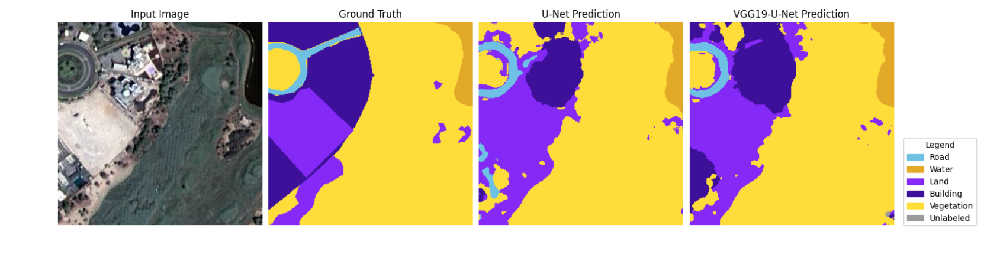
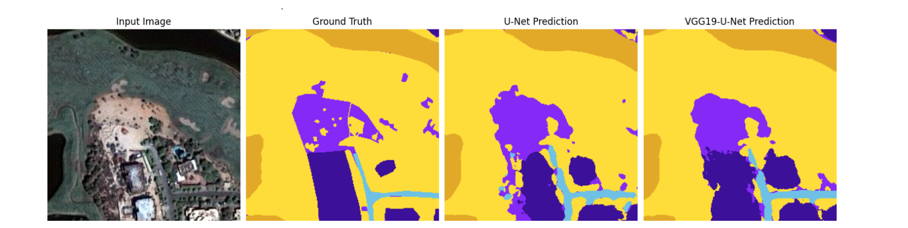
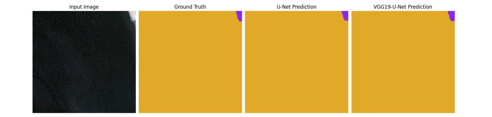

# Harnessing-U-Net-and-Transfer-Learning-for-Satellite-Image-Segmentation
Satellite image segmentation plays a crucial role in a wide range of geospatial applications, including land cover classification, urban planning, disaster response, and environmental monitoring.
This project focuses on semantic segmentation of high-resolution satellite images using deep learning. We implement deep learning-based semantic segmentation models for satellite imagery using the U-Net architecture and a transfer learning-based variant with VGG19 as the encoder (VGG19 U-Net).

## Objective 
We used the **[Semantic Segmentation of Aerial Imagery](https://www.kaggle.com/datasets/mohamednadjib/aerial-image-segmentation)** dataset from Kaggle.  
The objective is to accurately identify and segment features six classes namely **lands, roads, buildings, vegetation, water, unlabeled** from high-resolution aerial images using deep learning.

##  Data Preprocessing

To prepare the large satellite tiles for training:

- Images were **patchified** into fixed-size tiles (256,256,3)
- Applied **data augmentation** to increase diversity and reduce overfitting:
  - Horizontal & vertical flips
  - 90°, 180°, 270° rotations
-  Normalized input images for faster convergence
-  Performed categorical label encoding on color-coded ground truth masks
-  Split into 70% train, 20% validation, 10% test

##  Model Overview

- **U-Net**: Encoder-decoder architecture with skip connections
- **VGG19 U-Net**: Pretrained VGG19 as encoder with custom decoder

Both models were trained using:
- **Loss Function**: Dice Loss + Focal Loss (to handle class imbalance)
- **Performance metrics**: Jaccard coefficient(IoU), accuracy, Dice coefficient
- **Optimizer**: Adam
- **Batch Size**: 16

## Model Performance

| Model           | Val Accuracy | Val Dice  | Val IoU   | Val Loss | Test Accuracy | Test Dice | Test IoU  | Test Loss |
|-----------------|--------------|-----------|-----------|----------|---------------|-----------|-----------|-----------|
| **U-Net**       |   0.6704     | 0.8020    |  0.8367   | 0.9142   | 0.7083        | 0.8259    | 0.8399    | 0.9155    |
| **VGG19 U-Net** |   0.7024     | 0.8246    | 0.8541    | 0.9054   | 0.7339        | 0.8441    | 0.8552    | 0.9087    |

> VGG19 U-Net achieved better segmentation quality and boundary sharpness.

## Sample predictions using UNet and VGG19-UNet

## Dive Deeper into the Project  
Curious to see the **complete breakdown** of the model pipeline, preprocessing steps, visual results, and insights?
 I’ve documented everything in a blog post with visuals and intuition explained — perfect for beginners and ML enthusiasts!

📬 **Check out my full blog here**:  

## Let's Connect!

I'm always open to collaboration, discussion, or just a quick chat about AI and Machine Learning! Feel free to reach out:

  
  &nbsp;
  
  &nbsp;
  

