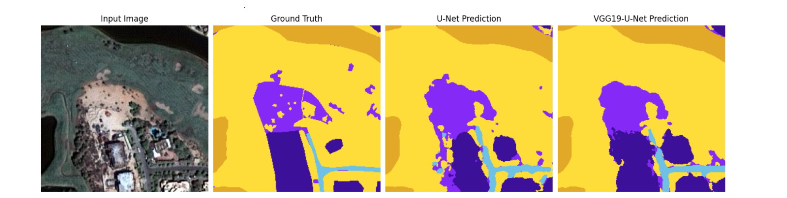

## Performance and predictions
The figures below illustrate the training progress of the U-Net model across multiple epochs. The plots capture training vs validation loss, training vs validation Jaccard coefficient, training vs validation accuracy and training vs validation Dice coefficient, providing insights into how well the U-Net model learnt over time.

Below two plots shows the training vs validation loss, training vs validation Jaccard coefficient, training vs validation accuracy and training vs validation Dice coefficient observed in the case of VGG19-UNet model training after various epochs.

Next, the table below presents a detailed comparison of the loss and evaluation metrics for both the models on the validation and test datasets.

Lastly, we visualize the segmentation outputs by plotting the predictions of both models side by side along with the ground truth masks.

